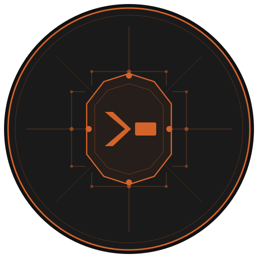

<p align="center">
  
</p>

# Claude Commander

> **Alpha software.** Built for single-admin personal use. Not hardened for multi-user or production deployments. Use at your own risk — Claude has full file access to mounted project directories.

A Telegram bot that lets you manage Claude Code sessions across multiple projects from your phone. Register project directories, send prompts, approve MCP tool access — all through Telegram.

## How It Differs from Claude Code's Built-in Telegram Channel

Claude Code has a native Telegram channel integration, but it's scoped to a **single session in a single directory**. Claude Commander is built for a different use case.

| | Claude Code channel | Claude Commander |
|---|---|---|
| Projects | One at a time | Many, persistent, switchable |
| Context | Tied to where you launched | Register any directory |
| Switching | Start a new session manually | `/switch` or "switch to X" |
| MCP servers | Inherited from launch env | Per-project, toggleable |
| Voice input | No | Yes (Groq Whisper) |
| Files & images | No | Yes (photos + any document) |
| Session memory | Lost on disconnect | Resumed across restarts |
| Tool approval | Terminal only | Inline Telegram buttons (waits for you) |

**When to use the built-in channel:** you're working in one project and want a Telegram mirror of your current Claude Code terminal session.

**When to use Claude Commander:** you manage multiple projects from your phone and need to jump between them, each with their own Claude session, MCP tools, and conversation history — without touching a terminal.

## How It Works

Claude Commander wraps the [Claude Agent SDK](https://docs.anthropic.com/en/docs/claude-code/sdk) using persistent `ClaudeSDKClient` connections. Each project gets a long-lived subprocess that stays warm — no cold start after the initial connection.

```
You (Telegram) --> Bot --> ClaudeSDKClient (persistent) --> Claude Code CLI --> Your project files
                   |
                   +--> SQLite (sessions, MCP permissions, feedback)
```

## Requirements

- Python 3.11+
- [uv](https://docs.astral.sh/uv/) package manager
- Telegram bot token (from [@BotFather](https://t.me/BotFather))
- Anthropic API key **or** a Claude Code subscription (Pro/Max)
- Docker (optional, for containerized deployment)

## Quick Install

```bash
curl -fsSL https://raw.githubusercontent.com/jflaflamme/claude-commander/main/install.sh | bash
```

This clones the repo, installs `uv` if needed, syncs dependencies, and on Linux automatically installs and enables the systemd user service. After it finishes:

```bash
# Fill in your credentials
nano ~/claude-commander/.env

# Start the bot
systemctl --user start claude-commander.service

# Auto-start at boot without login (one-time, needs sudo)
sudo loginctl enable-linger $USER
```

After that, send `/update` to your bot any time you want to pull the latest version and restart in-place.

## Manual Setup

### 1. Environment

```bash
git clone https://github.com/jflaflamme/claude-commander.git
cd claude-commander
cp .env.example .env
```

Fill in your `.env`:

```
TELEGRAM_BOT_TOKEN=your-bot-token     # from @BotFather
ADMIN_CHAT_ID=your-telegram-user-id   # your numeric Telegram user ID
ANTHROPIC_API_KEY=your-api-key        # optional — see Authentication below
GROQ_API_KEY=your-groq-api-key        # optional — voice message transcription
PROJECTS_DIR=/home/youruser/projects  # parent directory of your projects (Docker only)
CLAUDE_LOG_COMMANDS=0                  # set to 1 to log all Bash commands to ~/.claude/command-log.txt
```

### Authentication

The bot runs Claude via the `claude` CLI subprocess and inherits its authentication.

**Option A — Claude Code subscription (Pro/Max, no extra API costs):**

```bash
claude auth login   # one-time OAuth login
```

Then omit `ANTHROPIC_API_KEY` from your `.env`. The CLI uses your subscription automatically.

**Option B — Anthropic API key (pay-per-token):**

Set `ANTHROPIC_API_KEY` in `.env`. The API key takes priority over any logged-in session.

Verify which auth is active:

```bash
claude auth status
```

> **Docker note:** The container doesn't share your host's OAuth session. Either mount `~/.claude` into the container or use an API key for containerized deployments.

### 2. Run locally

```bash
uv sync
uv run python bot.py
```

### 3. Auto-start with systemd (Linux)

The installer sets this up automatically on Linux. To do it manually:

```bash
# Generate the service file
mkdir -p ~/.config/systemd/user
sed "s|{INSTALL_DIR}|$HOME/claude-commander|g" \
    ~/claude-commander/claude-commander.service \
    > ~/.config/systemd/user/claude-commander.service

# Enable and start
systemctl --user daemon-reload
systemctl --user enable claude-commander.service
systemctl --user start claude-commander.service
```

To start at boot without needing to log in (run once, needs sudo):

```bash
sudo loginctl enable-linger $USER
```

Check status and logs:

```bash
systemctl --user status claude-commander.service
journalctl --user -u claude-commander.service -f
```

To update a running service, just send `/update` to your bot — it pulls the latest code, syncs deps, and re-execs in place.

### 4. Run with Docker

Set `PROJECTS_DIR` in your `.env` to the parent directory that contains your projects:

```
PROJECTS_DIR=/home/youruser/projects
```

This directory is mounted into the container at the same path, so all project paths you register with `/add` must live under it. Then:

```bash
docker compose up --build -d
```

> **Note:** If your projects span multiple root directories, mount additional volumes manually in `docker-compose.yml`.

## Commands

| Command | Description |
|---------|-------------|
| `/help` | Show all commands |
| `/projects` | List projects with inline switch buttons |
| `/add <name> <path> [desc]` | Register a project directory |
| `/scan` | Find projects and add via buttons |
| `/remove <name>` | Unregister a project |
| `/ask <project> <prompt>` | Send a prompt to a project |
| `/switch [project]` | Set default for plain text |
| `/mcp <project>` | Manage MCP server access |
| `/status <project>` | Show session info |
| `/reset <project>` | Disconnect client and clear session |
| `/history <project>` | Past sessions |
| `/permissions` | List/revoke saved tool permissions |
| `/update` | Check for updates and restart |
| `/feedback <text>` | Submit feedback about the bot |

After `/ask` or `/switch`, plain text messages go directly to that project. You can also switch projects with natural language — `switch to myproject` or `use myproject` works the same as `/switch myproject`.

Commands are auto-registered via the `@cmd()` decorator — adding a new command automatically updates `/help`.

## Persistent Sessions

Each project gets a persistent `ClaudeSDKClient` connection. The CLI subprocess stays alive between prompts — no cold start overhead after the initial connection.

- **Background warmup** — on bot startup, all registered projects connect in the background
- **Full conversation memory** — Claude remembers everything within a session
- **Auto-reconnect** — if a client dies, it reconnects on the next prompt
- `/reset <project>` disconnects the client and starts a fresh conversation

First prompt to a new project takes ~15-30s (subprocess + MCP startup). Subsequent prompts are just API call time (~3-8s).

## MCP Servers

Projects with a `.mcp.json` file get MCP tools available to Claude.

- On `/add`, the bot shows found MCP servers as Allow/Deny buttons
- `/mcp <project>` lets you toggle servers on/off anytime
- Only enabled servers are passed to the session
- First run auto-allows all servers

## Voice Messages

Send a voice message and it's transcribed via [Groq Whisper](https://console.groq.com/) and routed to the active project as a prompt.

Set `GROQ_API_KEY` in your `.env` to enable it. Without it, voice messages return an error. The transcription is shown as a quote before the response so you can verify what was heard.

## Files & Images

Send any photo or document to the bot and it's downloaded and passed to the active project's Claude session along with the caption (if any).

- **Photos** — sent directly as attached files; useful for screenshots, diagrams, UI mockups
- **Documents** — any file type Telegram allows; Claude can read code files, CSVs, PDFs, etc.

The file path is included in the prompt so Claude can read or reference it. No extra configuration needed.

## Tool Permissions

When Claude wants to use a tool that isn't pre-approved, the bot sends an inline keyboard to Telegram asking what to do:

- **Allow once** — permits this single call and continues
- **Always** — saves the permission to the database; future calls to the same tool are auto-approved without prompting
- **Deny** — rejects the call and tells Claude to try a different approach

The bot waits **indefinitely** for your response — designed for phone-first use where you might not reply immediately. The prompt stays paused until you tap a button, no matter how long it takes.

Use `/permissions` to list and revoke saved "Always" approvals.

## Features

- **Persistent sessions** — `ClaudeSDKClient` keeps subprocesses warm, near-instant responses after first connect
- **Conversation memory** — full chat history within each project session
- **Voice input** — voice messages transcribed via Groq Whisper and sent as prompts
- **File & image input** — send photos or documents; Claude receives the file path and can read/reference them
- **Tool permission prompts** — Bash and other tools send Allow/Deny/Always buttons to Telegram; waits indefinitely for your response
- **Project scanning** — `/scan` finds projects in common directories by detecting `.git`, `.mcp.json`, `pyproject.toml`, etc.
- **Auto-routing** — plain text matches against project descriptions to pick the right project
- **Natural language switch** — "switch to X" or "use X" works like `/switch X`
- **Snappy greetings** — hi/hello/ping get an instant status reply without going to Claude
- **Live status updates** — status message shows "Clauding…" while waiting, then updates as Claude uses tools
- **Task interpretation** — prompts are prefixed with a brief intent tag (Bug Fix, Feature, Question…) before reaching Claude
- **Command logging** — set `CLAUDE_LOG_COMMANDS=1` to audit all Bash commands to `~/.claude/command-log.txt`
- **Contextual quick-reply buttons** — appear only when relevant (Fix it, Show diff, Run tests)
- **Cancel button** — abort a running prompt mid-flight
- **Per-project MCP control** — choose which MCP servers each project can use
- **Unknown command suggestions** — typos like `/project` suggest `/projects` via fuzzy match
- **Single-instance guard** — PID file prevents accidental duplicate bot instances
- **HTML formatting** — markdown converted to Telegram HTML with plain-text fallback
- **Self-update** — `/update` checks for new commits, shows a changelog, and restarts in-place on confirm

## Security

- **Single admin only** — every handler checks `ADMIN_CHAT_ID`. Unauthorized users get no response.
- **Tool permission prompts** — Claude runs in `acceptEdits` mode. File reads/edits are auto-approved; Bash commands and other tools send an inline Telegram prompt (Allow once / Always / Deny) before executing.
- **No credentials in code** — `.env` is gitignored. Never commit it.
- **MCP access control** — per-project MCP server allow/deny via `/mcp`
- **Project isolation** — each project runs in its own persistent session
- **Docker isolation** — only explicitly mounted volumes are accessible
- **Local database** — SQLite in `data/` stores sessions and permissions. Gitignored.
- **Command audit log** — set `CLAUDE_LOG_COMMANDS=1` to log every Bash command with timestamp to `~/.claude/command-log.txt`

## Architecture

Three files, flat structure:

- **`bot.py`** — Telegram bot. Command registry (`@cmd` decorator), inline keyboards, callback handlers, auto-routing, background warmup.
- **`claude_runner.py`** — `ClaudeSDKClient` wrapper. Persistent client pool, prompt queue, MCP config loading/filtering, auto-reconnect, markdown-to-HTML conversion.
- **`db.py`** — SQLite layer. Tables: `projects`, `sessions`, `permissions`, `project_mcp`, `feedback`.

## Known Limitations

- **Initial connect is slow** — first connection per project takes ~15-30s (CLI subprocess + MCP server startup). Mitigated by background warmup on bot startup.
- **Single admin** — no multi-user support. One `ADMIN_CHAT_ID` only.
- **No streaming** — responses arrive all at once, not streamed token-by-token.
- **Bot restart reconnects all** — persistent clients live in memory. Restarting the bot re-warms all projects.

## License

MIT
